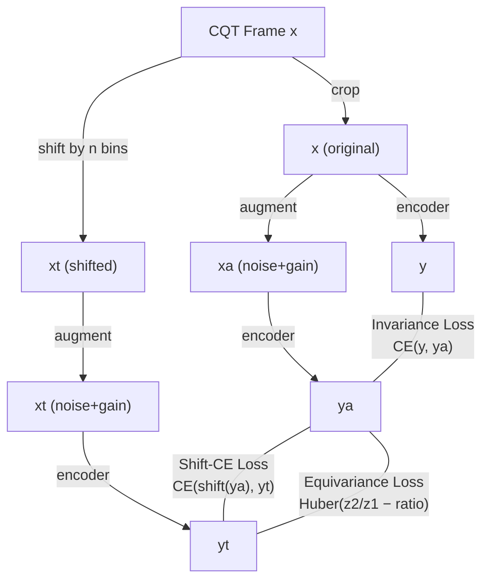

# PESTO Codebase: Comprehensive README

**PESTO** = **P**itch **E**stimation with **S**elf-supervised **T**ransposition-equivariant **O**bjective

Best Paper Award at ISMIR 2023. A self-supervised pitch estimation system that learns to predict fundamental frequency (F0) from audio *without any labeled pitch data during training*.

---

## 1. Overall Project Structure

```
pesto-full/
├── configs/                    # Hydra YAML configs (composable)
│   ├── train.yaml              # Top-level training config
│   ├── model/default.yaml      # Encoder arch + losses + optimizer
│   ├── data/default.yaml       # CQT params, batch size, transforms
│   ├── callbacks/              # Loss weighting, metrics, visualization
│   ├── trainer/                # GPU/CPU, epochs
│   └── ...                     # logger, paths, hydra, debug, experiment
├── src/
│   ├── train.py                # Entry point (Hydra + Lightning)
│   ├── models/
│   │   ├── pesto.py            # LightningModule — the Siamese training loop
│   │   └── networks/
│   │       └── resnet1d.py     # 1D ResNet encoder with ToeplitzLinear head
│   ├── data/
│   │   ├── audio_datamodule.py # Data loading, caching, cross-validation
│   │   ├── hcqt.py             # Harmonic CQT computation (via nnAudio)
│   │   ├── pitch_shift.py      # CQT-domain pitch shifting (bin rolling)
│   │   └── transforms.py       # Log-magnitude, random noise, random gain
│   ├── losses/
│   │   ├── base.py             # NullLoss, ComposeLoss abstractions
│   │   ├── equivariance.py     # PowerSeries equivariance loss (Huber)
│   │   └── entropy.py          # CrossEntropy + ShiftCrossEntropy
│   ├── callbacks/
│   │   ├── loss_weighting.py   # Gradient-based ALWA & warmup weighting
│   │   ├── mir_eval.py         # RPA/RCA/OA metrics via mir_eval
│   │   └── pitch_histogram.py  # W&B pitch histogram visualization
│   └── utils/
│       ├── reduce_activations.py  # argmax / mean / ALWA pitch reduction
│       ├── calibration.py         # Synthetic data for shift estimation
│       └── ...                    # Hydra resolvers, logging, Rich utils
└── environment.yml / requirements.txt
```

---

## 2. How the Model Works (High Level)


The core idea: the model processes **individual CQT frames** (not spectrograms over time), making it extremely fast. It uses a **Siamese-style training** where the same encoder processes the original and pitch-shifted versions of each CQT frame, then enforces that the output shifts accordingly.

---

## 3. What is an HCQT and Why Use It?

### The Constant-Q Transform (CQT)

A CQT is a time-frequency representation like a spectrogram, but with **logarithmic frequency spacing**. While a standard FFT/STFT has linearly-spaced frequency bins (every bin covers the same Hz range), the CQT spaces bins so that each octave has the same number of bins — exactly mirroring how musical pitch works.

| Representation | Frequency spacing | One octave up | Pitch shift = ? |
|---|---|---|---|
| **STFT** | Linear (every bin = same Hz width) | Different # of bins at different octaves | Complex resampling |
| **CQT** | Logarithmic (constant bins/octave) | Always same # of bins | **Just roll the bins** ← this is the key |

This logarithmic spacing means **transposing a note by N semitones simply shifts the CQT by N×bins_per_semitone bins**. This is why the entire PESTO architecture is built on CQTs — pitch shifting becomes a trivial array roll instead of expensive audio resampling.

### The *Harmonic* CQT (HCQT)

An HCQT stacks multiple CQTs computed at different base frequencies, each tuned to a different harmonic of the fundamental:

```
Harmonic 1: CQT at fmin = 27.5 Hz (A0)       ← fundamental
Harmonic 2: CQT at fmin = 55.0 Hz (A1)       ← 2nd harmonic
Harmonic 3: CQT at fmin = 82.5 Hz             ← 3rd harmonic
...
```

Each harmonic channel "sees" a different partial of the sound. This helps disambiguate **octave errors** — if harmonic 1 shows energy at 440 Hz and harmonic 2 shows energy at 880 Hz, the model can confirm it's hearing A4, not A5.

> [!NOTE]
> The default config uses only **1 harmonic** (`harmonics: [1]`), which means it's just a regular CQT. Adding more harmonics (e.g., `[0.5, 1, 2, 3, 4, 5]`) increases octave accuracy but also increases input channels and compute.

### Implementation

[hcqt.py](file:///Users/robbietylman/Documents/GitHub/pesto-full/src/data/hcqt.py) wraps nnAudio's GPU-accelerated CQT. It creates one `CQT` kernel per harmonic and stacks the results:

```python
# For each harmonic h, compute CQT with fmin scaled by h
self.cqt_kernels = nn.ModuleList([
    CQT(sr=sr, fmin=h*fmin, n_bins=n_bins, ...)
    for h in harmonics
])
# Stack: (channels, harmonics, freq_bins, time, 2)  [complex]
```

Output is **complex-valued** (real + imaginary), later converted to log-magnitude decibels by `ToLogMagnitude`.

---

## 4. Why Hz → MIDI Conversion?

In [audio_datamodule.py](file:///Users/robbietylman/Documents/GitHub/pesto-full/src/data/audio_datamodule.py#L24-L25):

```python
def hz_to_mid(freqs):
    return np.where(freqs > 0, 12 * np.log2(freqs / 440) + 69, 0)
```

**The CQT has logarithmic frequency spacing, and MIDI numbers are also logarithmic — so MIDI is the natural unit for this model.**

| Domain | Spacing | "One semitone" |
|--------|---------|----------------|
| **Hz** | Linear (440→880 = one octave, but so is 220→440) | Variable gap |
| **MIDI** | Linear (every +1 = one semitone) | Always +1 |
| **CQT bins** | Linear (every +`bins_per_semitone` bins = one semitone) | Always +3 bins (at 3 bps) |

MIDI and CQT bins are **directly proportional**: `pitch = bin_index / bins_per_semitone`. This means:

- **Pitch-shifting by `n` CQT bins** = shifting by `n/bps` MIDI semitones — simple addition
- **The equivariance loss** computes frequency ratios as `2^(n_steps/12)`, which only works cleanly in MIDI
- **The `reduce_activations` function** divides bin indices by `bps` to output MIDI values directly

If annotations stayed in Hz, you'd need expensive log conversions everywhere during training. By converting once at load time, the entire pipeline operates in the linear MIDI domain where **pitch transposition = addition**.

---

## 5. File-by-File Breakdown

### 5.1 Entry Point: [train.py](file:///Users/robbietylman/Documents/GitHub/pesto-full/src/train.py)

- Uses `@hydra.main` to compose config from YAML files
- Instantiates `AudioDataModule`, `PESTO` model, callbacks, loggers, and `Trainer` via `hydra.utils.instantiate`
- Calls `trainer.fit()` and optionally `trainer.test()`

### 5.2 The PESTO LightningModule: [pesto.py](file:///Users/robbietylman/Documents/GitHub/pesto-full/src/models/pesto.py)

The **heart of the system**:

| Method | Purpose |
|--------|---------|
| `forward()` | Crop CQT → encoder → softmax → ALWA reduction → pitch |
| `training_step()` | **Siamese training loop** (see §6) |
| `validation_step()` | Forward pass → collect predictions for metric computation |
| `estimate_shift()` | Calibrate absolute pitch via synthetic sinusoids (C4–B4) |
| `configure_optimizers()` | Adam + CosineAnnealing LR scheduler |

### 5.3 The Encoder: [resnet1d.py](file:///Users/robbietylman/Documents/GitHub/pesto-full/src/models/networks/resnet1d.py)

A **1D convolutional network** operating on frequency bins (not time):

```
Input: (batch, n_harmonics, freq_bins)     e.g. (256, 1, 263)
  │
  ├── LayerNorm over (channels, freq_bins)
  ├── Conv1d prefilter (kernel=15) + LeakyReLU + Dropout    ×2 (residual)
  ├── 1×1 Conv1d layers: 40→30→30→10→3→1    (channel reduction)
  ├── Flatten
  ├── ToeplitzLinear (263→384)               ★ KEY LAYER
  └── Softmax → (batch, 384)
```

> [!IMPORTANT]
> **ToeplitzLinear** is implemented as a `Conv1d` with a single kernel of size `in+out-1`. A Toeplitz matrix has constant values along each diagonal — the same linear transformation applies regardless of position. This mathematically guarantees **transposition equivariance**: shifting the input shifts the output by the same amount.

### 5.4 Data Pipeline

- **[audio_datamodule.py](file:///Users/robbietylman/Documents/GitHub/pesto-full/src/data/audio_datamodule.py)** — Reads audio lists, computes HCQT, hash-based `.npy` caching, K-Fold cross-validation
- **[pitch_shift.py](file:///Users/robbietylman/Documents/GitHub/pesto-full/src/data/pitch_shift.py)** — Pitch-shifting by bin-rolling in CQT domain (default ±5 bins = ±1.67 semitones)
- **[transforms.py](file:///Users/robbietylman/Documents/GitHub/pesto-full/src/data/transforms.py)** — `ToLogMagnitude` (complex→dB), `BatchRandomNoise`, `BatchRandomGain`

---

## 6. The Siamese Network: How Training Works

> [!NOTE]
> PESTO is not a classical Siamese network with two separate branches. It uses **one shared encoder** applied to **three views** of each input — closer to a self-supervised contrastive framework.

### The Training Step

```python
def training_step(self, batch, batch_idx):
    x, _ = batch                          # Labels are NEVER used in training

    x, xt, n_steps = self.pitch_shift(x)  # x=original, xt=shifted
    xa = self.transforms(x.clone())       # xa = augmented original
    xt = self.transforms(xt)              # xt = augmented + shifted

    y  = self.encoder(x)                  # clean original
    ya = self.encoder(xa)                 # augmented original
    yt = self.encoder(xt)                 # augmented + shifted

    inv_loss   = self.inv_loss_fn(y, ya)           # INVARIANCE
    sce_loss   = self.sce_loss_fn(ya, yt, n_steps) # SHIFT-CROSS-ENTROPY
    equiv_loss = self.equiv_loss_fn(ya, yt, n_steps) # EQUIVARIANCE
```

### The Three Losses



| Loss | Enforces | Implementation |
|------|----------|----------------|
| **Invariance** | Augmentations shouldn't change output | Symmetric cross-entropy between `y` and `ya` |
| **Shift-Cross-Entropy** | Shifting input by `n` bins → shift output by `n` bins | Pad + roll `ya` by `n_steps`, then CE with `yt` |
| **Equivariance** | Projected output ratio = frequency ratio | `PowerSeries` projects to scalar, Huber loss on `z2/z1 − 2^(n/12)` |

### Loss Weighting (Gradient-Based ALWA)

The three losses are combined with **adaptive weights** from their gradient norms w.r.t. the last layer. Losses with larger gradients get *lower* weight, preventing any single loss from dominating.

---

## 7. Parameter Count

With default config (`bins_per_semitone=3`, `n_harmonics=1`):

| Layer | Params | Calculation |
|-------|--------|-------------|
| LayerNorm | 526 | 2 × 1 × 263 |
| Conv1d prefilter (first) | 640 | 1 × 40 × 15 + 40 |
| Conv1d prefilter (residual) | 24,040 | 40 × 40 × 15 + 40 |
| 1×1 Conv layers (40→30→30→10→3→1) | 2,507 | sum of all 1×1 convs + biases |
| **ToeplitzLinear** | **646** | 1 kernel of size (263 + 384 − 1) |
| **Total** | **~28K** | |

> [!TIP]
> The model is **extremely lightweight** (~28K parameters). The ToeplitzLinear layer uses only **646 parameters** instead of 100K+ a regular linear layer would need (263 × 384). For comparison, CREPE has ~24M parameters — PESTO is roughly **850× smaller**.

---

## 8. From Activations to Pitch: The Reduction Step

The encoder outputs a 384-dim softmax distribution. To get a single pitch value:

| Method | How it works |
|--------|-------------|
| `argmax` | Bin with highest probability (fast, coarse) |
| `mean` | Weighted average `Σ(p_i × pitch_i)` (smooth but biased) |
| **`alwa`** (default) | Find peak, then weighted average over ±1 semitone window around peak (best accuracy, from CREPE) |

---

## 9. Shift Calibration

Since training is self-supervised, the model only learns **relative** pitch. To get **absolute** MIDI:

1. Generate synthetic sinusoids for C4–B4 (MIDI 60–71)
2. Run through encoder → get predictions
3. `shift = median(predictions − true_pitches)`
4. Subtract `shift` from all future predictions

Runs automatically at each validation epoch start.

---

## 10. Where PESTO Succeeds ✅

- **No labels needed** — fully self-supervised
- **Extremely fast** — frame-independent processing, real-time capable
- **Tiny model** — ~28K params, ~500MB GPU memory
- **Sub-semitone accuracy** — 3 bins/semitone + ALWA
- **Transposition equivariance** — mathematically guaranteed by ToeplitzLinear
- **Sampling rate agnostic** — CQT kernels computed dynamically
- **Smart caching** — hash-based `.npy` caching

## 11. Where PESTO Fails / Limitations ⚠️

- **Monophonic only** — cannot handle chords or polyphony
- **No voicing detection** — always predicts a pitch, even for silence
- **No temporal modeling** — frames are independent; no pitch tracking
- **Single harmonic default** — susceptible to octave errors without more HCQT harmonics
- **Limited augmentations** — only noise and gain; no reverb, time-stretch, etc.
- **Calibration dependency** — absolute pitch requires the synthetic sinusoid step

---

## 12. Use Cases

| Use Case | Why PESTO fits |
|----------|---------------|
| **Real-time pitch tracking** (tuners, live performance) | Tiny model + frame-independent = ultra-low latency |
| **Melody extraction** from singing | Self-supervised = no labeled singing data needed |
| **Music transcription preprocessing** | Fast F0 as input to note segmentation |
| **Query-by-humming** | Extract pitch contours for similarity matching |
| **Singing pedagogy** | Real-time pitch feedback for vocal training |
| **Pitch correction** (auto-tune) | Sub-semitone accuracy + real-time |
| **Edge / mobile deployment** | 28K params → easily fits on phones or embedded |

---

## 13. Key Design Decisions

| Decision | Rationale |
|----------|-----------|
| **CQT over Mel/STFT** | Logarithmic spacing → pitch shift = bin roll |
| **HCQT** | Multiple harmonics help disambiguate octave errors |
| **Hz→MIDI conversion** | MIDI is proportional to CQT bins; transposition = addition |
| **1D convolutions** | Each CQT frame is 1D over frequency; no time dimension |
| **ToeplitzLinear** | Translation equivariance in frequency = transposition equivariance |
| **Softmax + ALWA** | Classification over fine bins, then local weighted average for precision |
| **Three complementary losses** | Invariance (robustness), equivariance (structure), shift-CE (distribution matching) |
| **Gradient-based weighting** | Automatic loss balancing; prevents domination |
| **Frame-level processing** | Enables parallelism and real-time; no RNN/Transformer overhead |

---

## 14. Training on Different Datasets

Since PESTO is **fully self-supervised**, you can train it on *any* audio — no pitch labels needed (labels are only used for validation metrics). This makes dataset choice a powerful lever, but it also means the model's behavior is entirely shaped by what audio it sees.

### How to Set Up a Custom Dataset

1. Create file lists:
   ```shell
   find MyDataset/audio -name "*.wav" | sort > my_dataset.csv
   find MyDataset/annot -name "*.csv" | sort > my_dataset_annot.csv  # optional
   ```
2. Create `configs/data/my_dataset.yaml`:
   ```yaml
   defaults:
     - default
   audio_files: ${paths.data_dir}/my_dataset.csv
   annot_files: ${paths.data_dir}/my_dataset_annot.csv  # optional
   hop_duration: 10.  # must match annotation resolution if provided
   ```
3. Train: `python src/train.py data=my_dataset logger=csv`

### What Dataset Properties Matter

| Property | Effect on Model |
|----------|----------------|
| **Audio domain** (voice vs. instruments vs. mixed) | The model learns spectral patterns from whatever it sees — train on voice and it specializes in vocal formants; train on violin and it learns bowed-string harmonics |
| **Pitch range coverage** | If training data only covers MIDI 50–80, the model may struggle with very low bass or very high soprano notes it's never encountered |
| **Noise conditions** | Clean studio recordings → the model may fail on noisy real-world audio. Noisy/reverberant data → better robustness, but calibration may be harder |
| **Dataset size** | More frames = more diverse spectral patterns. With ~28K params, the model is unlikely to overfit even on small datasets, but diversity matters more than sheer size |
| **Harmonic structure** | Instruments with strong harmonics (voice, strings) give the equivariance loss more to work with. Inharmonic sounds (bells, drums) may confuse it |

### Predicted Effects by Dataset

| Dataset | Expected Effect |
|---------|----------------|
| **MIR-1K** (singing voice, ~1000 clips) | Good vocal pitch tracking; default choice in the repo. Small but focused |
| **MDB-stem-synth** (multi-instrument, synthesized) | Broader instrument coverage; clean signals help calibration |
| **MAESTRO** (piano, ~200 hours) | Excellent for piano pitch; may struggle with voice since piano has different spectral decay |
| **Large speech corpus** (LibriSpeech, VCTK) | Good for speech F0 (prosody, intonation); but speech has limited pitch range (~80–400 Hz) so high-pitch instruments will suffer |
| **Mixed music** (MUSDB18, raw songs) | Polyphonic audio will confuse a monophonic model — each frame may contain multiple pitches, so the self-supervised losses get contradictory signals |
| **Instrument-specific** (solo violin, solo flute) | Highly specialized; excellent accuracy on that instrument, but poor generalization to others |

> [!WARNING]
> **Training on polyphonic audio is problematic.** PESTO assumes one pitch per frame. If the training data contains chords or multi-instrument mixtures, the model receives conflicting self-supervised signals — the "original" and "shifted" views may lock onto different instruments, causing the equivariance loss to learn nonsense.

### Practical Recommendations

- **For general-purpose pitch tracking:** Train on a diverse monophonic dataset (clean singing + solo instruments from multiple pitch ranges)
- **For a specific instrument:** Train on isolated recordings of that instrument — the model will learn its unique spectral fingerprint
- **For noisy environments:** Include noisy recordings in training data, and consider increasing the `BatchRandomNoise` SNR range in the augmentation config
- **For best validation metrics:** Provide annotation files so you can monitor RPA/RCA/OA during training; the self-supervised losses alone don't tell you about absolute accuracy
- **If you see octave errors:** Try adding more HCQT harmonics (`data.harmonics=[0.5,1,2,3,4,5]`) — this increases `n_chan_input` to 6 and gives the model more harmonic context

---

## 15. Swapping the Encoder Architecture

PESTO cleanly separates the **training framework** (`pesto.py`) from the **encoder** (`resnet1d.py`). You can replace the encoder with any `nn.Module` — you only need to change **2–3 things**:

### What Your Encoder Must Satisfy

The `PESTO` LightningModule treats the encoder as a black box with this contract:

```python
# Input:  (batch_size, n_channels, freq_bins)  — e.g. (256, 1, 263)
# Output: (batch_size, output_dim)             — e.g. (256, 384)
#         Must be a probability distribution (softmax output)
```

It also accesses two attributes:
- **`encoder.fc.weight`** — used by `LossWeighting` to compute per-loss gradients ([pesto.py line 88](file:///Users/robbietylman/Documents/GitHub/pesto-full/src/models/pesto.py#L88))
- **`encoder.hparams`** — saved into checkpoints for inference loading ([pesto.py line 59](file:///Users/robbietylman/Documents/GitHub/pesto-full/src/models/pesto.py#L59))

### Step 1: Create Your Network

Add a new file, e.g. `src/models/networks/my_encoder.py`:

```python
import torch.nn as nn

class MyEncoder(nn.Module):
    def __init__(self, n_chan_input=1, n_bins_in=263, output_dim=384, **kwargs):
        super().__init__()
        self.hparams = dict(n_chan_input=n_chan_input, n_bins_in=n_bins_in,
                            output_dim=output_dim, **kwargs)

        # === YOUR ARCHITECTURE HERE ===
        # Example: simple MLP
        self.layers = nn.Sequential(
            nn.LayerNorm([n_chan_input, n_bins_in]),
            nn.Flatten(),
            nn.Linear(n_chan_input * n_bins_in, 256),
            nn.ReLU(),
            nn.Linear(256, 128),
            nn.ReLU(),
        )
        self.fc = nn.Linear(128, output_dim)  # ← must be named `fc`
        self.softmax = nn.Softmax(dim=-1)

    def forward(self, x):
        x = self.layers(x)
        x = self.fc(x)
        return self.softmax(x)
```

> [!IMPORTANT]
> The final layer **must** be named `self.fc` — the gradient-based loss weighting callback reads `self.encoder.fc.weight` to compute per-loss gradient norms. If you rename it, update [pesto.py line 88](file:///Users/robbietylman/Documents/GitHub/pesto-full/src/models/pesto.py#L88) as well.

### Step 2: Create a Model Config

Create `configs/model/my_model.yaml`:

```yaml
_target_: src.models.pesto.PESTO

encoder:
  _target_: src.models.networks.my_encoder.MyEncoder
  n_chan_input: ${len:${data.harmonics}}
  n_bins_in: ${eval:88 * ${data.bins_per_semitone}}
  output_dim: ${eval:128 * ${data.bins_per_semitone}}

# Keep the same losses, optimizer, pitch_shift, transforms from default
defaults:
  - default    # inherits equiv_loss_fn, inv_loss_fn, sce_loss_fn, optimizer, etc.
```

### Step 3: Train

```shell
python src/train.py data=mir-1k model=my_model logger=csv
```

### What You Must NOT Change

| File | Why it stays the same |
|------|-----------------------|
| `pesto.py` | The training loop, losses, and calibration are encoder-agnostic |
| `losses/*.py` | All losses operate on the encoder's output distribution, not its internals |
| `data/*.py` | The data pipeline is independent of the encoder |
| `callbacks/*.py` | Metrics and visualization only read `predictions` and `labels` |

### Things to Consider When Designing a New Encoder

- **Keep the Softmax output** — the equivariance and shift-CE losses assume a probability distribution
- **Consider equivariance** — `ToeplitzLinear` gives the default model *built-in* transposition equivariance. A standard `nn.Linear` will work but the model must *learn* equivariance purely from the losses, which is harder
- **Output dim = 128 × bins_per_semitone** — this is a hard constraint from `reduce_activations`, which assumes `output_dim % 128 == 0`
- **`n_bins_in`** comes from the CQT config (`n_bins` minus the pitch-shift margin), so any encoder must accept this as the input frequency dimension

---

## 16. Augmentations: What, Where, and Why

PESTO uses **three separate augmentation pipelines**, each applied at a different stage and feeding a different loss.

### Pipeline 1: `ToLogMagnitude` (Fixed Preprocessing)

**Where:** Applied to **every** batch (train + val) in `AudioDataModule.on_after_batch_transfer` ([audio_datamodule.py line 174](file:///Users/robbietylman/Documents/GitHub/pesto-full/src/data/audio_datamodule.py#L174))

**What:** Converts complex CQT → `20 * log10(|x|)` (decibel scale)

**Why:** Not really an "augmentation" — it's a fixed transform. Log-magnitude compresses the huge dynamic range of raw CQT values into a scale the network can learn from. Human hearing is also roughly logarithmic in amplitude, so dB is the natural domain.

### Pipeline 2: `BatchRandomNoise` + `BatchRandomGain` (Training Augmentations)

**Where:** Applied **only during training**, **only to the augmented views** in `PESTO.training_step` ([pesto.py lines 110–113](file:///Users/robbietylman/Documents/GitHub/pesto-full/src/models/pesto.py#L110-L113)):

```python
xa = self.transforms(x.clone())   # augmented original
xt = self.transforms(xt)          # augmented + shifted
# Note: y = self.encoder(x) uses the CLEAN original — no augmentation
```

| Augmentation | Effect | Default Config |
|---|---|---|
| `BatchRandomNoise` | Adds Gaussian noise scaled by signal std, random SNR | SNR ∈ [0.1, 2.0], p=0.7 |
| `BatchRandomGain` | Multiplies signal by random volume factor | Gain ∈ [0.5, 1.5], p=0.7 |

**Why they exist — they directly feed the invariance loss:**

```
x  ──encoder──▶ y   (clean)
xa ──encoder──▶ ya  (noisy + gain-shifted)
                │
    Invariance Loss: CE(y, ya)  ← "these should be equal!"
```

Without these augmentations, `x` and `xa` would be identical, making the invariance loss trivially zero — teaching the model nothing about robustness.

**Why p=0.7 (not 1.0)?** 30% of the time, augmentation is skipped (noise_std=0 or gain=1). This acts as a regularizer — it prevents the invariance loss from dominating by occasionally giving it "free" zero-loss samples.

### Pipeline 3: `PitchShiftCQT` (Structural Augmentation)

**Where:** Applied in `PESTO.training_step` ([pesto.py line 109](file:///Users/robbietylman/Documents/GitHub/pesto-full/src/models/pesto.py#L109)), implemented in [pitch_shift.py](file:///Users/robbietylman/Documents/GitHub/pesto-full/src/data/pitch_shift.py)

**What:** Rolls CQT bins by a random integer `n_steps` ∈ [−5, +5] (at 3 bps = ±1.67 semitones)

**Why:** This is the most critical augmentation — it creates the shifted view that feeds **both** the equivariance and shift-CE losses. Without it, PESTO cannot learn pitch structure at all.

### Summary: Which Augmentation Feeds Which Loss

| Augmentation | Creates | Feeds |
|---|---|---|
| `BatchRandomNoise` + `BatchRandomGain` | `xa` (augmented view) | **Invariance**: `CE(y, ya)` |
| `PitchShiftCQT` | `xt` (shifted view) | **Equivariance**: `Huber(z_yt/z_ya − ratio)` |
| `PitchShiftCQT` + noise/gain | `xt` after transforms | **Shift-CE**: `CE(roll(ya), yt)` |
